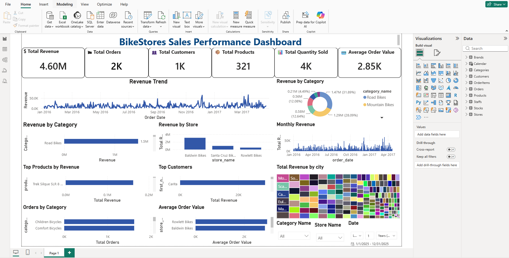

# 🚲 BikeStores Sales Analysis

## 📌 Project Overview

This project analyzes BikeStores sales data to understand sales performance, revenue trends, product performance, brand performance, and customer activity.

The project uses SQL Server for data analysis and Power BI for interactive data visualization.

---

## 🎯 Project Objective

The main objective of this project is to analyze sales data and identify useful business insights such as:

- Overall sales and revenue performance
- Top-performing products
- Brand-wise sales performance
- Monthly sales trends
- Customer and order analysis
- Product category performance

---

## 🛠️ Tools & Technologies

- **SQL Server** – Data extraction and analysis
- **SQL** – Data querying and analysis
- **Power BI** – Interactive dashboard and visualization
- **DAX** – KPI and calculated measures
- **Power Query** – Data cleaning and transformation
- **Excel** – Data preparation and validation

---

## 🔄 Project Workflow

1. Imported the BikeStores dataset into SQL Server.
2. Explored and validated the data.
3. Used SQL queries to analyze sales, products, customers, and brands.
4. Cleaned and transformed data using Power Query.
5. Created relationships between tables.
6. Developed DAX measures for key performance indicators.
7. Built an interactive Power BI sales dashboard.
8. Created visualizations to identify business trends and insights.

---

## 📊 Power BI Dashboard

The dashboard provides an overview of:

- 💰 Total Revenue
- 🛒 Total Orders
- 👥 Total Customers
- 📦 Product Performance
- 🏷️ Brand Performance
- 📈 Monthly Sales Trends
- 🔝 Top Products

### Dashboard Preview



---

## 🧮 SQL Analysis

The SQL analysis includes:

- SELECT statements
- WHERE filtering
- INNER JOIN and LEFT JOIN
- GROUP BY
- ORDER BY
- Aggregate functions
- CASE statements
- Subqueries
- Views
- Stored procedures
- Sales and revenue analysis

---

## 📁 Project Structure

```text
BikeStores-Data-Analysis
│
├── SQL
│   └── BikeStores_Database.sql
│
├── PowerBI
│   └── bikestore project.pbix
│
├── Screenshots
│   └── BikeStores_Dashboard.png
│
└── README.md

---

## 👩‍💻 Author

**Snehal Gire**

Data Analyst
